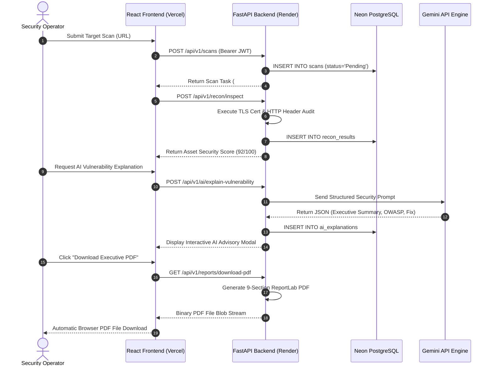

# AutoPentest AI - System Architecture Blueprint

This document presents the complete production architecture, data flow, and cloud deployment topology for **AutoPentest AI**.

---

## 1. High-Level Production System Architecture

```mermaid
flowchart TB
    subgraph ClientLayer ["Client Browser Layer"]
        User["Security Operator / CISO"]
        ReactApp["React 18 + Vite SPA\n(Cyber SOC Obsidian UI)"]
    end

    subgraph CDNLayer ["Vercel Global Edge Network"]
        VercelEdge["Vercel CDN\n(Static Assets & SPA Routing)"]
    end

    subgraph BackendLayer ["Render Cloud Web Services"]
        FastAPI["FastAPI Production Engine\n(Python 3.11 / Uvicorn)"]
        AuthModule["JWT Auth & Bcrypt Service"]
        ScanModule["Target Scan Orchestrator"]
        ReconModule["TLS & Asset Security Inspector"]
        RiskEngine["CVSS Risk Calculation Engine"]
        ReportLab["ReportLab PDF Generator"]
    end

    subgraph AIAdvisoryLayer ["AI Security Engine"]
        GeminiAPI["Gemini AI API\n(Structured Security Advisories)"]
        KnowledgeFallback["Security Knowledge Engine Fallback"]
    end

    subgraph DatabaseLayer ["Neon Serverless Infrastructure"]
        PostgreSQL[("Neon Serverless PostgreSQL\n(SQLAlchemy 2.0 Async / asyncpg)\n• users\n• scans\n• recon_results\n• findings\n• ai_explanations")]
    end

    User -->|HTTPS Request| VercelEdge
    VercelEdge -->|Serve React SPA| ReactApp
    ReactApp -->|REST API Calls (Bearer JWT)| FastAPI
    
    FastAPI --> AuthModule
    FastAPI --> ScanModule
    FastAPI --> ReconModule
    FastAPI --> RiskEngine
    FastAPI --> ReportLab
    
    FastAPI <-->|Structured JSON Prompts| GeminiAPI
    GeminiAPI -.->|Fallback if Offline| KnowledgeFallback
    
    FastAPI <-->|Async ORM Queries| PostgreSQL
```

---

## 2. Component Layer Responsibilities

### A. Frontend Layer (Vercel CDN)
- **Framework**: React 18, Vite, TypeScript, TailwindCSS v3, Chart.js.
- **Role**: Renders responsive SOC command center, threat level badges, live scan stdout log feeds, Chart.js visual analytics, SARIF report importer, and 1-click PDF download buttons.

### B. Application Layer (Render Cloud Service)
- **Framework**: FastAPI (Async Python 3.11 with Uvicorn ASGI server).
- **Security Features**: JWT token authentication with bcrypt password hashing, CORS whitelist, request audit logging middleware, and global exception handlers.

### C. Risk & AI Engine Layer
- **Risk Assessment**: Evaluates active findings using weighted CVSS vector impacts ($R = \min(100, \sum w_i N_i)$) and assigns Security Health Grades (`GRADE A+` to `GRADE F`).
- **AI Advisory**: Consults Gemini API to generate structured 6-section advisories (Executive Summary, Technical Cause, Business Impact, Attack Scenario, Remediation Guidance, OWASP Top 10 Mapping).

### D. Data Layer (Neon Serverless PostgreSQL)
- **ORM**: Async SQLAlchemy 2.0 with `asyncpg` driver.
- **Tables**: `users`, `scans`, `recon_results`, `findings`, `ai_explanations`.

---

## 3. Threat Model & Data Flow


