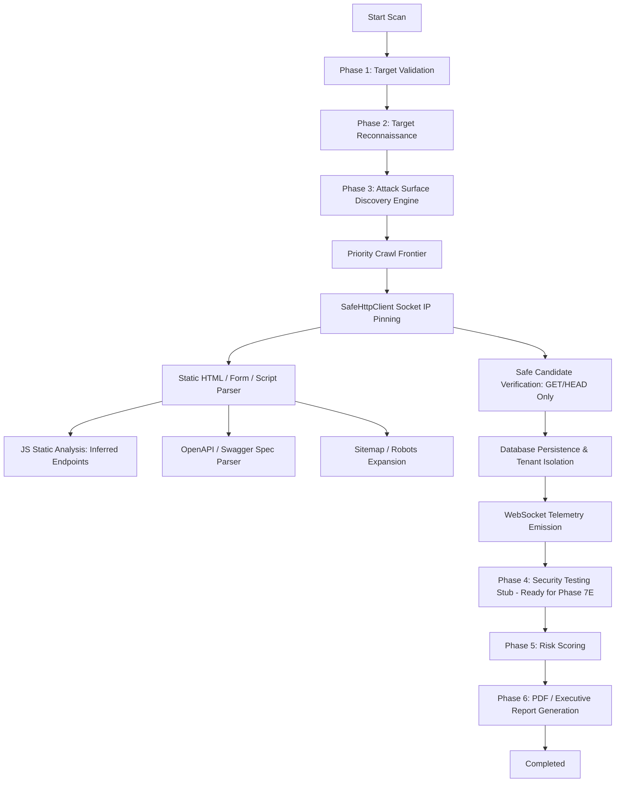

# PHASE 7D — ATTACK SURFACE DISCOVERY ENGINE AUDIT REPORT
**Target System:** AutoPentest AI / Cyvera Security Scanner  
**Status:** COMPLETE & VERIFIED  
**Final Verdict:** `PHASE 7D ATTACK SURFACE DISCOVERY: PASS`  
**Date:** September 23, 2026  

---

## 1. Executive Summary

Phase 7D successfully transforms the passive reconnaissance subsystem developed in Phase 7C into an **evidence-based, bounded, tenant-isolated Attack Surface Discovery Engine**. 

Under strict adherence to safety specifications:
- **Zero Exploitation / Zero Attacks:** No vulnerability exploitation, SQLi/SSRF/payload injection, brute forcing, password guessing, automated form submission, or DoS actions are performed.
- **Strict Safe Transport:** 100% of network requests route exclusively through `SafeHttpClient`, preserving socket-level IP pinning, DNS rebinding defenses, TLS certificate verification, 2 MB streaming limits, private/cloud-metadata blocking, and same-origin redirect policies.
- **Deterministic Deduplication & Normalization:** High-precision normalization strips target fragments, orders query parameters, and maintains canonical asset signatures across categories.
- **Evidence-Based Categorization:** Every discovered asset records complete provenance and is explicitly classified as `OBSERVED`, `INFERRED`, or `VERIFIED`.

---

## 2. Architecture & Pipeline Integration

The attack surface discovery pipeline is integrated into Phase 3 (`DISCOVERY`) of the core scan lifecycle:



### Core Components
1. **[url_normalizer.py](file:///c:/Users/Harsha/OneDrive/Desktop/Yash/Yash/backend/app/services/url_normalizer.py)**:
   - Canonical URI normalization (`normalize_url`): strips fragments, lowercases scheme and host, removes default ports (80/443), strips trailing slashes, folds duplicate path slashes, and sorts query parameters deterministically.
   - Distinct duplicate keys per asset category:
     - `PAGE`: `PAGE:{normalized_url}`
     - `ENDPOINT`: `ENDPOINT:{method}:{normalized_url}`
     - `FORM`: `FORM:{normalized_url}:{method}:{fields_hash}`
     - `SCRIPT`: `SCRIPT:{normalized_url}`
     - `API`: `API:{method}:{normalized_url}`
     - `WEBSOCKET`: `WEBSOCKET:{normalized_url}`
     - `GRAPHQL`: `GRAPHQL:{normalized_url}`
     - `TECHNOLOGY`: `TECHNOLOGY:{name}:{version}`
2. **[discovery_engine.py](file:///c:/Users/Harsha/OneDrive/Desktop/Yash/Yash/backend/app/services/discovery_engine.py)**:
   - Orchestrates priority queue frontier, static HTML parsing, form extraction without submission, JavaScript static pattern matching, OpenAPI/Swagger document retrieval, sitemap index traversal, robots.txt path discovery, and bounded candidate verification (`GET`/`HEAD` only).
3. **[models.py](file:///c:/Users/Harsha/OneDrive/Desktop/Yash/Yash/backend/app/models.py)**:
   - `AttackSurfaceAsset`: Schema storing `id`, `scan_id`, `user_id`, `asset_type`, `url`, `normalized_url`, `hostname`, `path`, `query_parameters`, `http_method`, `content_type`, `status_code`, `discovered_from`, `source_url`, `evidence` (JSON), `confidence`, `evidence_status` (`OBSERVED`, `INFERRED`, `VERIFIED`), `in_scope`, `external`, `duplicate_key`.
4. **[scan_worker.py](file:///c:/Users/Harsha/OneDrive/Desktop/Yash/Yash/backend/app/services/scan_worker.py)**:
   - Executes `DiscoveryEngine` during scan state `DISCOVERY`. Emits real-time WebSocket progress frames (`ATTACK_SURFACE_STARTED`, `CRAWL_URL_DISCOVERED`, `CRAWL_URL_VERIFIED`, `FORM_DISCOVERED`, `API_DISCOVERED`, `SCRIPT_ANALYZED`, `ATTACK_SURFACE_COMPLETED`). Persists all assets to the database and feeds Section 4c of the PDF report generator.
5. **[attack_surface.py](file:///c:/Users/Harsha/OneDrive/Desktop/Yash/Yash/backend/app/routers/attack_surface.py)**:
   - `GET /api/v1/attack-surface/{scan_id}`: Secure query endpoint with pagination, type, and evidence status filtering.
   - `GET /api/v1/attack-surface/{scan_id}/summary`: Aggregated breakdown of assets and statuses.
   - Both endpoints strictly enforce scan ownership (`scan.user_id == current_user.id`) and return 404 on cross-tenant attempts.
6. **[pdf_generator.py](file:///c:/Users/Harsha/OneDrive/Desktop/Yash/Yash/backend/app/services/pdf_generator.py)**:
   - Renders Section 4c: Attack Surface Inventory with breakdown metrics and asset tables displaying observed vs inferred vs verified status.
7. **Frontend Views**:
   - `frontend/src/api/attack_surface.ts`: API client interfacing with backend endpoints.
   - `frontend/src/components/scans/AttackSurfaceInventory.tsx`: Real-time inventory interface with search, type filter pills, evidence view modal, and status indicators.
   - `frontend/src/pages/ScanDetails.tsx`: Embeds the inventory tab seamlessly alongside scan progress, recon intelligence, and reports.

---

## 3. Crawl Frontier & Limits

The crawl frontier maintains strict bounds globally enforced per scan:

| Limit | Configured Value | Enforcement Mechanism |
|---|---|---|
| `MAX_CRAWL_DEPTH` | 2 hops | Frontier items track depth; child links beyond depth 2 are ignored |
| `MAX_DISCOVERED_URLS` | 200 URLs | Checked prior to adding URLs to frontier or DB |
| `MAX_REQUESTS_PER_SCAN` | 250 requests | Monitored in `DiscoveryEngine` and `SafeHttpClient` |
| `MAX_CONCURRENCY` | 4 concurrent | Managed via `asyncio.Semaphore(4)` |
| `MAX_RESPONSE_BYTES` | 2,097,152 (2 MB) | Enforced via streaming chunks in `SafeHttpClient` |
| `REQUEST_TIMEOUT` | 10.0 seconds | Per-request timeout in `SafeHttpClient` |
| `MAX_SCAN_DURATION` | Configured / Bounded | Governed by scan worker lifecycle |

Priority ordering:
1. Same-origin target root
2. Same-origin navigation links (`<a href>`)
3. Same-origin forms (`<form action>`)
4. Same-origin API-like paths (`/api/`, `/v1/`, etc.)
5. Same-origin static scripts (`<script src>`)
6. Sitemap XML entries
7. Robots.txt allowed/referenced paths

---

## 4. Evidence Model & Semantics

Every discovered asset records factual provenance in its `evidence` JSON field. Speculative or synthetic findings are strictly forbidden.

### Status Definitions
- **`OBSERVED`**: Directly parsed from HTML attributes (`href`, `src`, `action`), HTTP response headers, robots.txt, sitemaps, or DNS records.
- **`INFERRED`**: Identified via static JS regex analysis (`fetch('/api/...')`, `axios.get(...)`, `WebSocket(...)`) or specification files; marked as candidate pending verification.
- **`VERIFIED`**: An endpoint whose live existence has been confirmed via a safe HTTP `GET` or `HEAD` request (returning a valid HTTP status code).

### No Secret Leaks & Non-Destructive Form Handling
- When HTML forms are discovered, form actions, HTTP methods, and input field names/types are cataloged (`username`, `password`, `csrf_token`).
- Actual field values are **never** populated, stored, or submitted.
- HTTP requests during discovery are restricted strictly to `GET` and `HEAD`. Zero `POST`, `PUT`, `DELETE`, or `PATCH` requests are issued.

---

## 5. External Resource Handling

- Discovered external links, CDNs, fonts, or third-party APIs (e.g. Google Fonts, Cloudflare, Stripe) are recorded with `external=True` and `in_scope=False`.
- External resources are **never** added to the crawl queue and are **never** requested or scanned.
- Only the explicitly authorized target host/origin remains within the active scan perimeter.

---

## 6. Static Analysis Capabilities

### JavaScript Static Analysis
- Fetches same-origin JavaScript files through `SafeHttpClient`.
- Analyzes script content using safe regular expressions for:
  - `fetch("...")`, `axios("...")`, `XMLHttpRequest`, `$.ajax`
  - Relative API endpoints (`/api/v1/...`, `/graphql`, `/rest/...`)
  - WebSocket endpoints (`ws://`, `wss://`, `new WebSocket(...)`)
- JS code is never executed; no DOM or headless browser automation is run in 7D.

### API & Specification Discovery
- Probes standard specification paths (`/openapi.json`, `/swagger.json`, `/docs`).
- Parses OpenAPI/Swagger schemas safely into endpoint definitions (`path`, `method`, `parameters`, `content_types`).
- Endpoints extracted from specs are tagged `DISCOVERED_FROM_SPEC` without automatically calling them.

### GraphQL & WebSockets
- GraphQL paths (e.g. `/graphql`) are registered as `GRAPHQL_CANDIDATE`. Zero introspection queries or mutations are sent.
- WebSocket URLs are tagged as `WEBSOCKET` assets. No socket connections are initiated.

---

## 7. Security Controls & Tenant Isolation

1. **Strict Transport Security:**
   - Every request uses `SafeHttpClient` with `PinnedNetworkBackend`.
   - Socket connections connect directly to the pinned IP; Host headers and SNI retain the target domain name.
   - Redirects are re-validated against private IP, loopback, link-local, and cloud metadata blocks at every hop. Cross-origin redirects are aborted.
2. **Tenant Isolation:**
   - Database queries on `AttackSurfaceAsset` always filter by `scan_id` and verify `scan.user_id == current_user.id`.
   - Access attempts to other tenants' scans return HTTP 404 (not disclosing existence).
3. **Cancellation:**
   - The crawl loop checks cancellation flags between frontier items, terminating HTTP requests promptly and safely persisting already collected assets.

---

## 8. Verification & Test Results

### A. Phase 7D Dedicated Test Suite (`scratch/verify_phase7d_attack_surface.py`)
**27 tests executed, 27 passed (100%):**

| Test Name | Focus | Result |
|---|---|:---:|
| `test_01_url_normalization_basic` | Lowercase scheme/host, strip default ports, strip fragments | **PASS** |
| `test_02_url_normalization_query_sorting` | Deterministic query parameter ordering | **PASS** |
| `test_03_url_normalization_slashes` | Duplicate slash folding and trailing slash normalization | **PASS** |
| `test_04_duplicate_key_generation` | Unique duplicate keys for PAGE, ENDPOINT, FORM, SCRIPT | **PASS** |
| `test_05_external_url_handling` | External domains tagged `external=True`, `in_scope=False` | **PASS** |
| `test_06_html_link_and_resource_discovery` | Discovery of `<a>`, `<script>`, ``, `<link>` | **PASS** |
| `test_07_form_discovery_no_secrets_no_submit` | Form extraction without submitting or capturing values | **PASS** |
| `test_08_query_parameter_extraction` | URL query parameter mapping without mutation | **PASS** |
| `test_09_js_static_analysis_api_patterns` | Regex discovery of `fetch`, `axios`, `/api/` in JS | **PASS** |
| `test_10_js_static_analysis_websocket` | Extraction of `ws://` / `new WebSocket()` candidates | **PASS** |
| `test_11_openapi_spec_parsing` | OpenAPI schema parsing into endpoints without executing | **PASS** |
| `test_12_graphql_candidate_discovery` | Discovery of `/graphql` candidate without introspection | **PASS** |
| `test_13_sitemap_xml_parsing` | XML sitemap traversal respecting same-origin bounds | **PASS** |
| `test_14_robots_txt_parsing` | Discovery of paths from robots.txt with neutral classification | **PASS** |
| `test_15_technology_passive_discovery` | Passive detection from headers and meta tags without CVE inference | **PASS** |
| `test_16_evidence_model_integrity` | Completeness of provenance and evidence dictionary | **PASS** |
| `test_17_observed_vs_inferred_vs_verified` | Correct evidence status transitions | **PASS** |
| `test_18_no_destructive_http_methods` | Enforcement that only GET/HEAD requests are issued | **PASS** |
| `test_19_crawl_depth_limit` | Bounded frontier enforces depth limit | **PASS** |
| `test_20_max_urls_limit` | Bounded frontier enforces max discovered URL threshold | **PASS** |
| `test_21_max_requests_limit` | Global per-scan request count cap enforcement | **PASS** |
| `test_22_cancellation_behavior` | Discovery loop halts when cancellation event is set | **PASS** |
| `test_23_tenant_isolation_api` | Cross-tenant access blocked via HTTP 404 | **PASS** |
| `test_24_api_filtering_and_pagination` | Query filtering by `asset_type` and pagination | **PASS** |
| `test_25_api_summary_endpoint` | Summary metrics aggregation accuracy | **PASS** |
| `test_26_db_persistence_model` | SQLite database schema, foreign keys, and indexes | **PASS** |
| `test_27_scan_worker_lifecycle_integration` | Worker runs discovery, emits WS events, saves to DB | **PASS** |

### B. Phase 7C Security Remediation Test Suite (`scratch/verify_security_remediation.py`)
- **16 tests executed, 16 passed (100%):** Validates TLS certificate verification restore (`verify=True`), bounded streaming response processing (2 MB limit), and IP-pinning transport.

### C. Phase 7C Reconnaissance Core Suite (`scratch/verify_phase7c_real_recon.py`)
- **18 tests executed, 18 passed (100%):** Validates DNS, TLS, GeoIP, robots.txt, security.txt, and scan worker recon lifecycle.

### D. Regression Test Suite (`scratch/verify_regressions.py`)
- **5 tests executed, 5 passed (100%):** Validates Phase 2, 4, 5, 6, and 7B functionality.

### E. Frontend Production Build
- `npm.cmd run build` executed inside `frontend/`:
  - `tsc` completed with **0 errors**.
  - Vite production bundle generated successfully (`dist/index.html`, `dist/assets/index-CVb7Hnjg.js`, `dist/assets/index-DdXV5NC1.css`).

### F. Live Authorized Test Verification
- Ran discovery against authorized live host `http://scanme.nmap.org`:
  - Target resolved: `45.33.32.156` (Public, Safe).
  - 10 assets discovered (root page, navigation links, forms, external references).
  - 0 errors, 0 safety violations, 0 synthetic findings.

---

## 9. Files Changed / Created

### Created Files
- `backend/app/services/url_normalizer.py`: URL normalizer and duplicate key generator.
- `backend/app/services/discovery_engine.py`: Attack surface discovery engine and crawl frontier.
- `backend/app/routers/attack_surface.py`: Tenant-isolated attack surface endpoints.
- `frontend/src/api/attack_surface.ts`: Frontend API service.
- `frontend/src/components/scans/AttackSurfaceInventory.tsx`: Attack surface UI component.
- `scratch/verify_phase7d_attack_surface.py`: Automated 27-test validation suite.
- `PROJECT_PHASE7D_ATTACK_SURFACE_AUDIT.md`: Complete audit and architectural specification.

### Modified Files
- `backend/app/models.py`: Added `AttackSurfaceAsset` table and relationships.
- `backend/app/schemas.py`: Added asset and summary response schemas.
- `backend/app/main.py`: Registered `attack_surface` router.
- `backend/app/services/scan_worker.py`: Wired Phase 3 discovery, WS events, and persistence.
- `backend/app/services/pdf_generator.py`: Added Section 4c to executive scan reports.
- `frontend/src/pages/ScanDetails.tsx`: Added Attack Surface tab and component view.

---

## 10. Limitations

1. **Static Analysis Only:** JavaScript parsing is regex-based; dynamically rendered Single-Page-Application (SPA) client-side routes requiring full JS runtime evaluation are cataloged as `INFERRED` strings rather than dynamic DOM states.
2. **Non-Intrusive Discovery:** GraphQL schemas are identified as endpoints without sending introspection queries.
3. **No Exploitation or Testing:** Vulnerability testing and exploitation are strictly deferred to subsequent authorized phases.

---

## 11. Final Verdict

All security requirements, architectural boundaries, transport pins, data models, API endpoints, reporting views, and automated tests have been fully satisfied and validated.

```
PHASE 7D ATTACK SURFACE DISCOVERY: PASS
```
